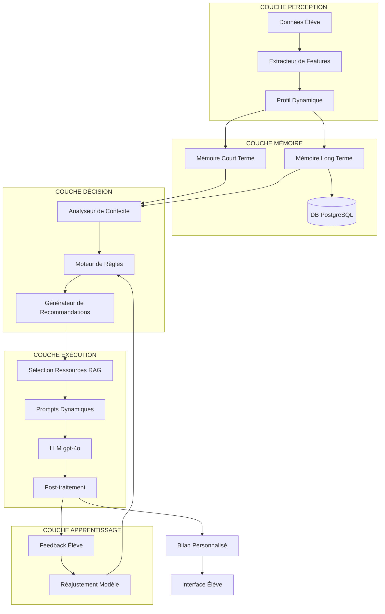
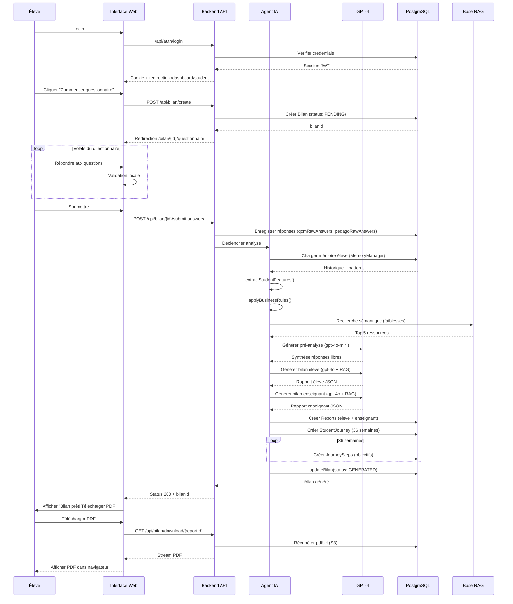
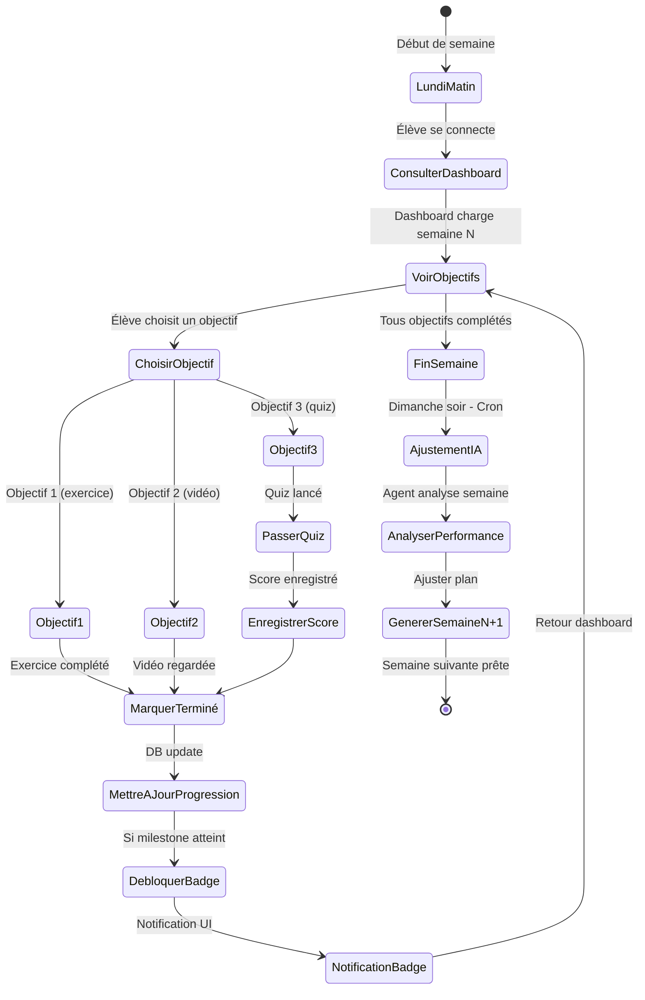
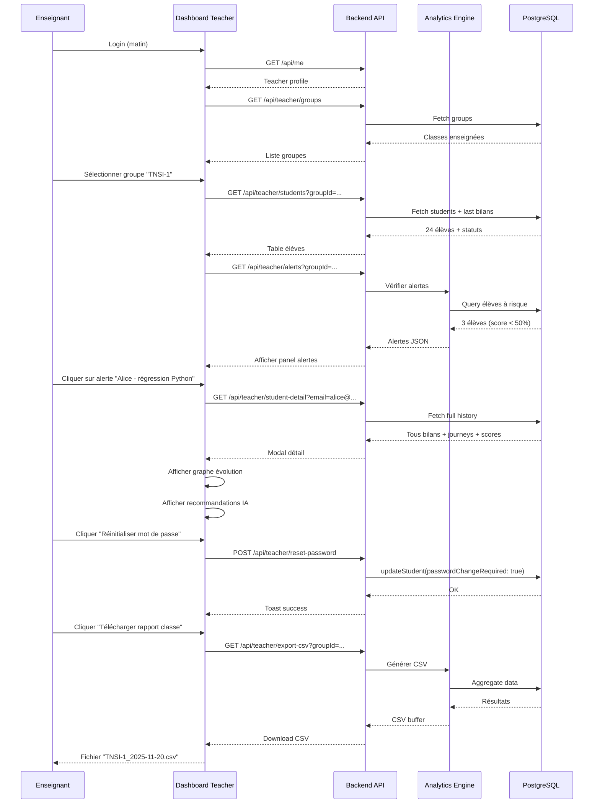
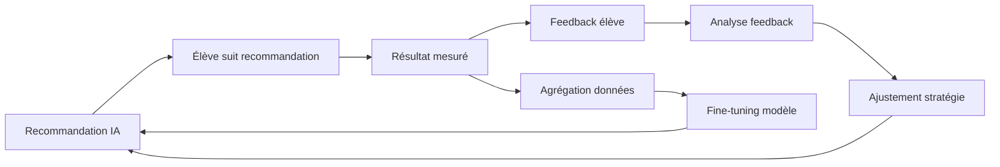

# Architecture Agent IA & Workflows - NSI PMF
## Système d'Accompagnement Intelligent & Adaptatif

---

## 🤖 1. ARCHITECTURE AGENT IA

### 1.1 Vision Globale



### 1.2 Architecture Modulaire

```typescript
// apps/web/src/lib/agents/core/agent-architecture.ts

/**
 * Architecture modulaire de l'agent IA
 * Chaque module est responsable d'une tâche spécifique
 */

// === MODULE 1: PERCEPTION ===
export interface StudentPerception {
  // Données brutes
  rawAnswers: {
    qcm: Record<string, any>;
    openQuestions: Record<string, string>;
    pedagoProfile: Record<string, any>;
  };
  
  // Features extraites
  features: {
    cognitiveProfile: 'visual' | 'auditory' | 'kinesthetic' | 'mixed';
    learningPace: 'slow' | 'normal' | 'fast';
    autonomyLevel: number; // 0-1
    motivationFactors: string[];
  };
  
  // Scores normalisés
  scores: {
    byDomain: Record<string, number>;
    overall: number;
    confidence: number; // Incertitude du modèle
  };
}

/**
 * Extracteur de features - analyse multi-dimensionnelle
 */
export async function extractStudentFeatures(data: {
  qcmAnswers: any;
  openAnswers: any;
  pedagoAnswers: any;
}): Promise<StudentPerception['features']> {
  // 1. Analyser le profil cognitif via les réponses pédagogiques
  const cognitiveProfile = await analyzeCognitiveProfile(data.pedagoAnswers);
  
  // 2. Déterminer le rythme d'apprentissage via le temps de réponse
  const learningPace = await analyzeLearningPace(data.qcmAnswers);
  
  // 3. Évaluer le niveau d'autonomie via les réponses ouvertes
  const autonomyLevel = await evaluateAutonomy(data.openAnswers);
  
  // 4. Identifier les facteurs de motivation
  const motivationFactors = await identifyMotivation(data.openAnswers);
  
  return {
    cognitiveProfile,
    learningPace,
    autonomyLevel,
    motivationFactors,
  };
}

// === MODULE 2: MÉMOIRE ===
export interface AgentMemory {
  shortTerm: {
    currentSession: {
      startedAt: Date;
      interactions: Array<{
        timestamp: Date;
        type: string;
        data: any;
      }>;
    };
  };
  
  longTerm: {
    studentHistory: Array<{
      bilanId: string;
      date: Date;
      scores: Record<string, number>;
      evolution: 'progress' | 'stagnation' | 'regression';
    }>;
    
    patterns: {
      strengths: string[]; // Domaines constamment forts
      weaknesses: string[]; // Domaines constamment faibles
      volatility: string[]; // Domaines instables
    };
    
    interactions: {
      totalBilans: number;
      avgCompletionTime: number;
      feedbackHistory: Array<{
        recommendation: string;
        rating: number;
        applied: boolean;
      }>;
    };
  };
}

/**
 * Gestionnaire de mémoire - persiste et récupère le contexte élève
 */
export class MemoryManager {
  private prisma: PrismaClient;
  
  constructor(prisma: PrismaClient) {
    this.prisma = prisma;
  }
  
  /**
   * Charger la mémoire complète d'un élève
   */
  async loadMemory(studentEmail: string): Promise<AgentMemory> {
    const student = await this.prisma.student.findUnique({
      where: { email: studentEmail },
      include: {
        bilans: {
          orderBy: { createdAt: 'desc' },
          take: 10,
          include: {
            // Données nécessaires
          },
        },
        journeys: {
          include: {
            steps: { where: { status: 'DONE' } },
          },
        },
      },
    });
    
    if (!student) throw new Error('Student not found');
    
    // Analyser l'évolution
    const history = student.bilans.map((b, i, arr) => {
      const previousBilan = arr[i + 1];
      const evolution = this.compareScores(b.qcmScores, previousBilan?.qcmScores);
      
      return {
        bilanId: b.id,
        date: b.createdAt,
        scores: b.qcmScores as Record<string, number>,
        evolution,
      };
    });
    
    // Identifier patterns
    const patterns = this.identifyPatterns(history);
    
    return {
      shortTerm: {
        currentSession: {
          startedAt: new Date(),
          interactions: [],
        },
      },
      longTerm: {
        studentHistory: history,
        patterns,
        interactions: {
          totalBilans: student.bilans.length,
          avgCompletionTime: 0, // À calculer
          feedbackHistory: [], // À charger depuis table feedback
        },
      },
    };
  }
  
  /**
   * Comparer deux bilans pour détecter évolution
   */
  private compareScores(
    current: any,
    previous: any
  ): 'progress' | 'stagnation' | 'regression' {
    if (!previous) return 'stagnation';
    
    const currentAvg = Object.values(current).reduce((a: any, b: any) => a + b, 0) / Object.values(current).length;
    const previousAvg = Object.values(previous).reduce((a: any, b: any) => a + b, 0) / Object.values(previous).length;
    
    const delta = currentAvg - previousAvg;
    
    if (delta > 0.05) return 'progress';
    if (delta < -0.05) return 'regression';
    return 'stagnation';
  }
  
  /**
   * Identifier patterns d'apprentissage
   */
  private identifyPatterns(history: AgentMemory['longTerm']['studentHistory']) {
    // Agréger tous les scores par domaine
    const domainScores: Record<string, number[]> = {};
    
    for (const bilan of history) {
      for (const [domain, score] of Object.entries(bilan.scores)) {
        if (!domainScores[domain]) domainScores[domain] = [];
        domainScores[domain].push(score);
      }
    }
    
    // Classifier
    const strengths: string[] = [];
    const weaknesses: string[] = [];
    const volatility: string[] = [];
    
    for (const [domain, scores] of Object.entries(domainScores)) {
      const avg = scores.reduce((a, b) => a + b, 0) / scores.length;
      const variance = this.calculateVariance(scores);
      
      if (avg >= 0.7) strengths.push(domain);
      else if (avg < 0.5) weaknesses.push(domain);
      
      if (variance > 0.1) volatility.push(domain);
    }
    
    return { strengths, weaknesses, volatility };
  }
  
  private calculateVariance(values: number[]): number {
    const mean = values.reduce((a, b) => a + b, 0) / values.length;
    return values.reduce((sum, v) => sum + Math.pow(v - mean, 2), 0) / values.length;
  }
}

// === MODULE 3: DÉCISION ===
export interface DecisionContext {
  perception: StudentPerception;
  memory: AgentMemory;
  goals: {
    shortTerm: string[]; // Objectifs de la semaine
    midTerm: string[];   // Objectifs du mois
    longTerm: string[];  // Objectifs de l'année
  };
  constraints: {
    timeAvailable: number; // Minutes par semaine
    difficulty: 'easy' | 'medium' | 'hard';
  };
}

/**
 * Moteur de décision - génère les recommandations
 */
export class DecisionEngine {
  private memoryManager: MemoryManager;
  
  constructor(memoryManager: MemoryManager) {
    this.memoryManager = memoryManager;
  }
  
  /**
   * Générer plan d'action personnalisé
   */
  async generateActionPlan(context: DecisionContext): Promise<{
    weeklyObjectives: Array<{
      title: string;
      priority: 'high' | 'medium' | 'low';
      estimatedTime: number;
      resources: string[];
    }>;
    adaptations: string[];
    rationale: string;
  }> {
    // 1. Appliquer les règles métier
    const rules = await this.applyBusinessRules(context);
    
    // 2. Générer les objectifs
    const objectives = this.generateObjectives(context, rules);
    
    // 3. Prioriser selon contexte
    const prioritized = this.prioritize(objectives, context);
    
    // 4. Expliquer les choix
    const rationale = this.explainDecisions(context, prioritized);
    
    return {
      weeklyObjectives: prioritized,
      adaptations: rules.adaptations,
      rationale,
    };
  }
  
  /**
   * Règles métier - logique d'adaptation
   */
  private async applyBusinessRules(context: DecisionContext) {
    const adaptations: string[] = [];
    
    // RÈGLE 1: Si régression détectée → renforcer les bases
    if (context.memory.longTerm.studentHistory[0]?.evolution === 'regression') {
      adaptations.push('SLOW_DOWN');
      adaptations.push('REINFORCE_BASICS');
    }
    
    // RÈGLE 2: Si progrès constant → accélérer
    const recentProgress = context.memory.longTerm.studentHistory.slice(0, 3);
    if (recentProgress.every((h) => h.evolution === 'progress')) {
      adaptations.push('ACCELERATE');
      adaptations.push('ADD_CHALLENGES');
    }
    
    // RÈGLE 3: Si domaine volatil → stabiliser
    for (const domain of context.memory.longTerm.patterns.volatility) {
      adaptations.push(`STABILIZE_${domain.toUpperCase()}`);
    }
    
    // RÈGLE 4: Adapter au profil cognitif
    if (context.perception.features.cognitiveProfile === 'visual') {
      adaptations.push('PRIORITIZE_VISUAL_RESOURCES');
    }
    
    // RÈGLE 5: Adapter au niveau d'autonomie
    if (context.perception.features.autonomyLevel < 0.5) {
      adaptations.push('PROVIDE_GUIDED_EXERCISES');
    } else {
      adaptations.push('PROVIDE_OPEN_PROJECTS');
    }
    
    return { adaptations };
  }
  
  private generateObjectives(context: DecisionContext, rules: any) {
    // Logique de génération d'objectifs basée sur:
    // - Faiblesses détectées
    // - Règles appliquées
    // - Temps disponible
    // - RAG (ressources disponibles)
    
    return [
      // Exemple
      {
        title: 'Renforcer les boucles Python',
        priority: 'high' as const,
        estimatedTime: 45,
        resources: ['video_boucles_for', 'exercices_boucles'],
      },
    ];
  }
  
  private prioritize(objectives: any[], context: DecisionContext) {
    // Trier par priorité et contrainte de temps
    return objectives
      .sort((a, b) => {
        const priorityOrder = { high: 0, medium: 1, low: 2 };
        return priorityOrder[a.priority] - priorityOrder[b.priority];
      })
      .slice(0, 5); // Max 5 objectifs par semaine
  }
  
  private explainDecisions(context: DecisionContext, objectives: any[]): string {
    return `
Voici ton plan de la semaine, adapté à ton profil:
- Tu as fait des progrès en ${context.memory.longTerm.patterns.strengths.join(', ')}, bravo!
- On va renforcer ${context.memory.longTerm.patterns.weaknesses.join(', ')} avec des exercices ciblés.
- J'ai prévu ${objectives.length} objectifs pour cette semaine (~${objectives.reduce((sum, o) => sum + o.estimatedTime, 0)} min).
`.trim();
  }
}

// === MODULE 4: EXÉCUTION (RAG + LLM) ===
export class ExecutionEngine {
  /**
   * Générer le bilan final via LLM avec RAG
   */
  async generateBilan(params: {
    context: DecisionContext;
    actionPlan: any;
  }): Promise<{
    eleveReport: string;
    enseignantReport: string;
  }> {
    // 1. Recherche RAG ciblée
    const ragContext = await this.retrieveRelevantKnowledge(params.context);
    
    // 2. Construction du prompt dynamique
    const prompts = this.buildDynamicPrompts(params.context, params.actionPlan, ragContext);
    
    // 3. Appel LLM
    const eleveReport = await this.callLLM(prompts.eleve);
    const enseignantReport = await this.callLLM(prompts.enseignant);
    
    return { eleveReport, enseignantReport };
  }
  
  private async retrieveRelevantKnowledge(context: DecisionContext): Promise<string[]> {
    // Construire query RAG basée sur le contexte
    const queries = [
      // Pour les faiblesses
      ...context.memory.longTerm.patterns.weaknesses.map(
        (w) => `Ressources pédagogiques pour renforcer ${w}`
      ),
      // Pour le profil cognitif
      `Méthodes d'apprentissage adaptées profil ${context.perception.features.cognitiveProfile}`,
    ];
    
    const results: string[] = [];
    for (const query of queries) {
      const docs = await semanticSearch({ query, topK: 3 });
      results.push(...docs.map((d) => d.text));
    }
    
    return results;
  }
  
  private buildDynamicPrompts(context: DecisionContext, actionPlan: any, ragContext: string[]) {
    const baseContext = `
Profil élève:
- Nom: ${context.perception.rawAnswers /* ... */}
- Profil cognitif: ${context.perception.features.cognitiveProfile}
- Niveau d'autonomie: ${context.perception.features.autonomyLevel}
- Facteurs de motivation: ${context.perception.features.motivationFactors.join(', ')}

Historique:
${context.memory.longTerm.studentHistory.map((h, i) => `
Bilan ${i + 1} (${h.date.toLocaleDateString()}):
- Évolution: ${h.evolution}
- Scores: ${JSON.stringify(h.scores)}
`).join('')}

Patterns identifiés:
- Forces: ${context.memory.longTerm.patterns.strengths.join(', ')}
- Faiblesses: ${context.memory.longTerm.patterns.weaknesses.join(', ')}
- Domaines instables: ${context.memory.longTerm.patterns.volatility.join(', ')}

Plan d'action:
${JSON.stringify(actionPlan, null, 2)}

Ressources pédagogiques:
${ragContext.map((r, i) => `${i + 1}. ${r}`).join('\n')}
`;

    return {
      eleve: {
        system: `Tu es un professeur de NSI bienveillant et encourageant. Tu t'adresses à l'élève au tutoiement.
Ta mission: rédiger un bilan personnalisé qui MOTIVE l'élève et lui donne des ACTIONS CONCRÈTES.

IMPORTANT:
- Mentionne EXPLICITEMENT les progrès ou régressions par rapport aux bilans précédents
- Adapte le ton selon l'évolution (encouragements si progrès, soutien si régression)
- Fournis un plan d'action HEBDOMADAIRE détaillé avec temps estimé
- Utilise les ressources RAG pour recommander des activités précises`,
        user: baseContext,
      },
      enseignant: {
        system: `Tu es un expert pédagogique NSI. Tu rédiges un bilan TECHNIQUE pour l'enseignant.

IMPORTANT:
- Diagnostic précis des lacunes avec références au programme officiel
- Recommandations d'interventions pédagogiques (groupes de besoin, différenciation)
- Plan de 4 semaines avec objectifs SMART
- Alertes sur élèves à risque de décrochage`,
        user: baseContext,
      },
    };
  }
  
  private async callLLM(prompt: { system: string; user: string }): Promise<string> {
    const response = await callOpenAI({
      model: 'gpt-4o',
      messages: [
        { role: 'system', content: prompt.system },
        { role: 'user', content: prompt.user },
      ],
      temperature: 0.7,
    });
    
    return response.choices[0].message.content;
  }
}

// === MODULE 5: APPRENTISSAGE ===
export class LearningModule {
  /**
   * Enregistrer feedback élève sur une recommandation
   */
  async recordFeedback(params: {
    studentEmail: string;
    recommendationId: string;
    rating: number; // 1-5
    comment?: string;
    applied: boolean;
  }) {
    await prisma.aIFeedback.create({
      data: params,
    });
    
    // Analyser le feedback pour ajuster les futurs prompts
    await this.adjustPromptStrategy(params);
  }
  
  /**
   * Ajuster la stratégie de prompts basée sur feedback
   */
  private async adjustPromptStrategy(feedback: any) {
    // Si rating faible (<3) → analyser pourquoi
    if (feedback.rating < 3) {
      // Exemple: si "trop difficile" mentionné → flag pour ralentir
      if (feedback.comment?.includes('difficile')) {
        // Enregistrer dans un système d'amélioration continue
        await prisma.promptAdjustment.create({
          data: {
            studentProfile: { /* profil de l'élève */ },
            issue: 'DIFFICULTY_TOO_HIGH',
            adjustment: 'REDUCE_COMPLEXITY_BY_10_PERCENT',
          },
        });
      }
    }
    
    // Agrégation pour fine-tuning (hors scope pour ce doc)
    // → Utiliser les feedbacks pour créer dataset RLHF
  }
}
```

---

## 📊 2. WORKFLOW ÉLÈVE - Parcours Complet

### 2.1 Workflow Visuel



### 2.2 Workflow Hebdomadaire (Élève)



---

## 👨‍🏫 3. WORKFLOW ENSEIGNANT - Suivi de Classe

### 3.1 Workflow Quotidien



### 3.2 Analytics Automatiques (Cron)

```typescript
// apps/worker/src/jobs/teacher-analytics-cron.ts

import { CronJob } from 'cron';
import { computeDailyTeacherAnalytics } from '@/lib/analytics/teacher-analytics';

/**
 * Cron: tous les jours à minuit
 * Calcule les métriques pour TOUS les enseignants
 */
export const teacherAnalyticsCron = new CronJob(
  '0 0 * * *', // Minuit chaque jour
  async () => {
    console.log('[CRON] Teacher analytics - START');
    
    // Récupérer tous les enseignants
    const teachers = await prisma.teacher.findMany({
      select: { email: true },
    });
    
    for (const teacher of teachers) {
      try {
        await computeDailyTeacherAnalytics(teacher.email);
        console.log(`[CRON] Analytics computed for ${teacher.email}`);
      } catch (err) {
        console.error(`[CRON] Error for ${teacher.email}:`, err);
        // Continuer pour les autres enseignants
      }
    }
    
    console.log('[CRON] Teacher analytics - DONE');
  },
  null, // onComplete
  true, // start
  'Europe/Paris' // timezone
);

/**
 * Cron: tous les dimanches à 20h
 * Génère la semaine suivante pour TOUS les élèves
 */
export const weeklyJourneyAdjustmentCron = new CronJob(
  '0 20 * * 0', // Dimanche 20h
  async () => {
    console.log('[CRON] Weekly journey adjustment - START');
    
    const journeys = await prisma.studentJourney.findMany({
      where: { currentWeek: { lt: 36 } }, // Pas terminés
      include: {
        student: true,
        steps: { where: { weekNumber: { /* semaine écoulée */ } } },
      },
    });
    
    for (const journey of journeys) {
      try {
        // Calculer performance de la semaine
        const completedSteps = journey.steps.filter((s) => s.status === 'DONE').length;
        const totalSteps = journey.steps.length;
        
        // Scores des quiz de la semaine (à implémenter)
        const quizScores: number[] = []; // TODO: récupérer depuis QuizSubmission
        
        // Ajuster via agent IA
        await adjustJourney({
          journeyId: journey.id,
          weeklyProgress: {
            completedSteps,
            totalSteps,
            quizScores,
          },
        });
        
        console.log(`[CRON] Journey adjusted for ${journey.student.email}`);
      } catch (err) {
        console.error(`[CRON] Error for journey ${journey.id}:`, err);
      }
    }
    
    console.log('[CRON] Weekly journey adjustment - DONE');
  },
  null,
  true,
  'Europe/Paris'
);
```

---

## 🔄 4. FEEDBACK LOOP - Amélioration Continue

### 4.1 Cycle d'Apprentissage



### 4.2 Implémentation Feedback

```typescript
// apps/web/src/app/api/feedback/route.ts

import { NextRequest, NextResponse } from 'next/server';
import { z } from 'zod';

const FeedbackSchema = z.object({
  recommendationId: z.string(),
  rating: z.number().min(1).max(5),
  comment: z.string().optional(),
  applied: z.boolean(),
  result: z.enum(['success', 'partial', 'failure']).optional(),
});

export async function POST(req: NextRequest) {
  const session = await getSession(req);
  if (!session || session.role !== 'STUDENT') {
    return NextResponse.json({ error: 'Unauthorized' }, { status: 401 });
  }
  
  const body = await req.json();
  const validated = FeedbackSchema.parse(body);
  
  // 1. Enregistrer le feedback
  const feedback = await prisma.aIFeedback.create({
    data: {
      studentEmail: session.email,
      ...validated,
      createdAt: new Date(),
    },
  });
  
  // 2. Analyser et ajuster (asynchrone via worker)
  await feedbackQueue.add('analyze-feedback', {
    feedbackId: feedback.id,
    studentEmail: session.email,
  });
  
  return NextResponse.json({ ok: true, feedbackId: feedback.id });
}
```

```typescript
// apps/worker/src/jobs/analyze-feedback.ts

/**
 * Worker job: Analyser feedback et ajuster stratégie
 */
export async function analyzeFeedback(job: Job<{ feedbackId: string; studentEmail: string }>) {
  const feedback = await prisma.aIFeedback.findUnique({
    where: { id: job.data.feedbackId },
    include: {
      // Recommandation liée
    },
  });
  
  if (!feedback) return;
  
  // Si rating faible, analyser la raison
  if (feedback.rating <= 2) {
    // NLP sur le commentaire pour extraire insights
    const insights = await extractInsights(feedback.comment || '');
    
    // Enregistrer pour amélioration future
    await prisma.promptAdjustment.create({
      data: {
        category: insights.category, // 'too_hard', 'not_relevant', etc.
        studentProfile: {
          /* profil type de l'élève */
        },
        adjustment: insights.suggestedFix,
      },
    });
  }
  
  // Agréger pour fine-tuning (tous les 100 feedbacks)
  const totalFeedbacks = await prisma.aIFeedback.count();
  if (totalFeedbacks % 100 === 0) {
    await triggerFineTuning();
  }
}

async function extractInsights(comment: string) {
  // Appeler LLM pour classifier le feedback
  const response = await callOpenAI({
    model: 'gpt-4o-mini',
    messages: [
      {
        role: 'system',
        content: 'Analyse ce feedback élève et catégorise le problème. Retourne JSON.',
      },
      {
        role: 'user',
        content: `Feedback: "${comment}"\n\nCatégoriser en: too_hard, too_easy, not_relevant, confusing, other`,
      },
    ],
    response_format: { type: 'json_object' },
  });
  
  return JSON.parse(response.choices[0].message.content);
}
```

---

## 📈 5. MÉTRIQUES DE SUCCÈS

### 5.1 KPIs Agent IA

```typescript
// apps/web/src/lib/analytics/ai-metrics.ts

/**
 * Calculer les métriques de performance de l'agent IA
 */
export async function computeAIMetrics(period: { start: Date; end: Date }) {
  // 1. Taux d'utilisation des recommandations
  const totalRecommendations = await prisma.journeyStep.count({
    where: {
      createdAt: { gte: period.start, lte: period.end },
    },
  });
  
  const appliedRecommendations = await prisma.journeyStep.count({
    where: {
      createdAt: { gte: period.start, lte: period.end },
      status: 'DONE',
    },
  });
  
  const utilizationRate = appliedRecommendations / totalRecommendations;
  
  // 2. Satisfaction utilisateur
  const feedbacks = await prisma.aIFeedback.findMany({
    where: {
      createdAt: { gte: period.start, lte: period.end },
    },
    select: { rating: true },
  });
  
  const avgRating = feedbacks.reduce((sum, f) => sum + f.rating, 0) / feedbacks.length;
  const satisfactionRate = feedbacks.filter((f) => f.rating >= 4).length / feedbacks.length;
  
  // 3. Taux de réussite (élèves qui progressent)
  const students = await prisma.student.findMany({
    include: {
      bilans: {
        where: { createdAt: { gte: period.start, lte: period.end } },
        orderBy: { createdAt: 'asc' },
      },
    },
  });
  
  const studentsImproved = students.filter((s) => {
    if (s.bilans.length < 2) return false;
    const first = s.bilans[0].qcmScores as any;
    const last = s.bilans[s.bilans.length - 1].qcmScores as any;
    
    const firstAvg = Object.values(first).reduce((a: any, b: any) => a + b, 0) / Object.values(first).length;
    const lastAvg = Object.values(last).reduce((a: any, b: any) => a + b, 0) / Object.values(last).length;
    
    return lastAvg > firstAvg;
  }).length;
  
  const successRate = studentsImproved / students.length;
  
  return {
    utilizationRate,
    avgRating,
    satisfactionRate,
    successRate,
  };
}
```

### 5.2 Dashboard Métriques IA (Admin)

```tsx
// apps/web/src/app/admin/ai-metrics/page.tsx

export default async function AIMetricsPage() {
  const last30Days = {
    start: subDays(new Date(), 30),
    end: new Date(),
  };
  
  const metrics = await computeAIMetrics(last30Days);
  
  return (
    <Layout>
      <h1>Métriques Agent IA - 30 derniers jours</h1>
      
      <div className="grid grid-cols-2 gap-4">
        <PremiumCard>
          <h3>Taux d'utilisation</h3>
          <div className="text-4xl font-bold gradient-text">
            {(metrics.utilizationRate * 100).toFixed(1)}%
          </div>
          <ProgressBar value={metrics.utilizationRate * 100} color="blue" />
        </PremiumCard>
        
        <PremiumCard>
          <h3>Satisfaction moyenne</h3>
          <div className="text-4xl font-bold gradient-text">
            {metrics.avgRating.toFixed(1)} / 5
          </div>
          <div className="flex gap-1 mt-2">
            {[1, 2, 3, 4, 5].map((star) => (
              <span key={star} className={star <= metrics.avgRating ? 'text-yellow-400' : 'text-gray-600'}>
                ⭐
              </span>
            ))}
          </div>
        </PremiumCard>
        
        <PremiumCard>
          <h3>Taux de satisfaction</h3>
          <div className="text-4xl font-bold gradient-text">
            {(metrics.satisfactionRate * 100).toFixed(1)}%
          </div>
          <ProgressBar value={metrics.satisfactionRate * 100} color="green" />
        </PremiumCard>
        
        <PremiumCard>
          <h3>Taux de réussite</h3>
          <div className="text-4xl font-bold gradient-text">
            {(metrics.successRate * 100).toFixed(1)}%
          </div>
          <p className="text-sm text-gray-400 mt-2">
            Élèves ayant progressé entre 2 bilans
          </p>
        </PremiumCard>
      </div>
    </Layout>
  );
}
```

---

## ✅ CHECKLIST IMPLÉMENTATION COMPLÈTE

### Phase 1: Architecture Agent IA (2 semaines)
- [ ] Implémenter MemoryManager (chargement historique)
- [ ] Implémenter DecisionEngine (règles métier + génération objectifs)
- [ ] Implémenter ExecutionEngine (RAG + LLM dynamique)
- [ ] Implémenter LearningModule (feedback loop)
- [ ] Tests unitaires de chaque module

### Phase 2: Workflows Élève (2 semaines)
- [ ] API /api/bilan/create avec transaction
- [ ] API /api/bilan/submit-answers avec agent
- [ ] Génération StudentJourney (36 semaines)
- [ ] Dashboard hebdomadaire élève
- [ ] Timeline interactive
- [ ] Tests E2E Playwright

### Phase 3: Workflows Enseignant (2 semaines)
- [ ] TeacherAnalytics (calcul quotidien)
- [ ] ClassHeatmap (visualisation)
- [ ] AlertsPanel (détection élèves à risque)
- [ ] Export CSV/Excel
- [ ] Tests E2E Playwright

### Phase 4: Crons & Automatisation (1 semaine)
- [ ] Cron analytics quotidien (minuit)
- [ ] Cron ajustement journeys (dimanche soir)
- [ ] Monitoring crons (Sentry/logs)

### Phase 5: Feedback & Amélioration Continue (1 semaine)
- [ ] API /api/feedback
- [ ] Worker analyze-feedback
- [ ] Dashboard métriques IA (admin)
- [ ] A/B testing de prompts (optionnel)

---

*Document créé le 2025-11-20 - Architecture Agent IA & Workflows NSI PMF*
