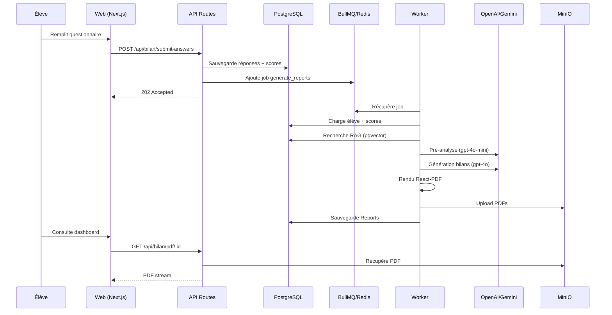
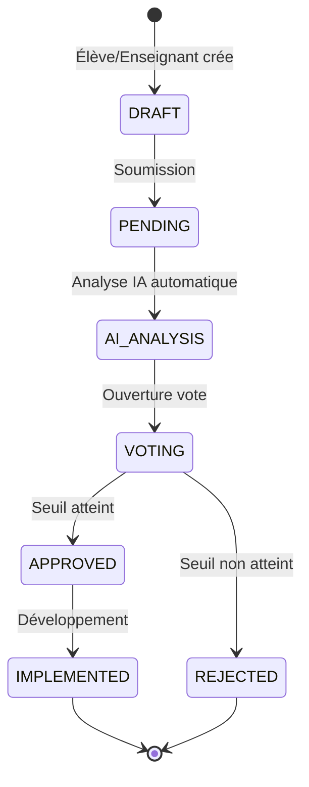

# RAPPORT D'AUDIT COMPLET - PLATEFORME NSI-PMF 2025

**Date**: 20 Novembre 2025  
**Auditeur**: Agent IA Antigravity (Google DeepMind)  
**Projet**: Interface NSI Bilan Support Suivi - Lycée Pierre Mendès France  
**Auteur Original**: Alaeddine BEN RHOUMA

---

## 📋 RÉSUMÉ EXÉCUTIF

### Vision du Projet
La plateforme NSI-PMF est un **outil pédagogique innovant** combinant:
- 🎓 **Bilans pédagogiques personnalisés** pour élèves de Terminale NSI
- 🤖 **Intelligence Artificielle générative** (OpenAI GPT-4o, Gemini) avec RAG
- 📊 **Suivi de progression** et analytics pour enseignants
- 🏛️ **Gouvernance participative** (en cours d'implémentation)
- 📚 **Hub de ressources** NSI (Première & Terminale)

### État Actuel
✅ **Points Forts**:
- Architecture solide (Next.js 14 + Worker BullMQ + PostgreSQL/pgvector)
- Pipeline de génération de bilans fonctionnel (React-PDF)
- RAG opérationnel avec embeddings Gemini
- Tests E2E Playwright robustes
- Observabilité (Prometheus/Grafana)

⚠️ **Points d'Amélioration Identifiés**:
- Gouvernance DAO non implémentée (schéma ajouté, API à créer)
- Page d'accueil basique (améliorée dans cet audit)
- Parcours élève/enseignant à optimiser
- Documentation utilisateur limitée
- Déploiement production à finaliser

---

## 🏗️ ARCHITECTURE & INFRASTRUCTURE

### 1. Stack Technique

#### Frontend
- **Framework**: Next.js 14 (App Router)
- **UI**: React 18, Tailwind CSS
- **État**: React Context (providers.tsx)
- **Validation**: Zod
- **Tests**: Playwright E2E, Jest unitaires

#### Backend
- **API**: Next.js API Routes (App Router)
- **Worker**: BullMQ + Node.js
- **Base de données**: PostgreSQL 15 + pgvector
- **Cache/Queue**: Redis 7
- **Stockage**: MinIO (S3-compatible)

#### IA & ML
- **LLM**: OpenAI GPT-4o/4o-mini, Gemini 1.5 Pro/Flash
- **Embeddings**: Gemini text-embedding-004 (768d)
- **RAG**: pgvector semantic search

#### Observabilité
- **Métriques**: Prometheus
- **Dashboards**: Grafana
- **Logs**: Sentry (web + worker)

### 2. Architecture de Données

#### Modèles Principaux
```prisma
Student ──1:n── Attempt ──1:n── Report (eleve/enseignant)
                    ├── Score (par domaine)
                    └── Tag (indicateurs)

Teacher ──n:m── Group ──1:n── Student

Bilan (legacy + nouveau workflow)
StudentProfileData (agrégats durables)

// NOUVEAUX MODÈLES (ajoutés dans cet audit)
Proposal ──1:n── Vote
         └──1:n── Comment (student/teacher/AI_AGENT)
```

#### Extensions Curriculum
```prisma
CurrTheme ──1:n── Notion ──n:m── Exercise
                        ├── Resource
                        ├── TeacherCoverage
                        └── StudentMastery

Quiz ──1:n── QuizItem ──1:n── SubmissionItem
                            └── Grading
```

### 3. Flux de Données



---

## 🔍 AUDIT DÉTAILLÉ PAR COMPOSANT

### A. FRONTEND (apps/web)

#### 1. Pages & Routing

**✅ Existant**:
- `/login` - Authentification
- `/dashboard` - Dashboards élève/enseignant
- `/bilan/initier` - Démarrage bilan
- `/bilan/[id]/questionnaire` - Questionnaire
- `/bilans` - Liste bilans évaluations
- `/quiz` - Système de quiz
- `/rag` - Upload documents RAG

**🆕 Ajouté dans cet audit**:
- `/` - Page d'accueil moderne (Hero, QuickAccess, News, FAQ)
- `/decouvrir-nsi` - Présentation NSI (placeholder)
- `/governance` - Conseil des Sages (à implémenter)

**📝 Recommandations**:
1. **Parcours élève optimisé**:
   ```
   / → /decouvrir-nsi → /login → /dashboard/student
   └── /bilan/initier → /questionnaire → /resultats → /pdf
   ```

2. **Parcours enseignant**:
   ```
   / → /login → /dashboard/teacher
   ├── /bilans (vue classe)
   ├── /quiz (création exercices)
   ├── /rag (upload ressources)
   └── /governance (propositions)
   ```

3. **Navigation améliorée**:
   - Breadcrumbs sur toutes les pages
   - Indicateur de progression questionnaire
   - Notifications temps réel (WebSocket pour statut bilans)

#### 2. Composants UI

**✅ Bibliothèque existante** (`components/ui/`):
- Button, Card, Input, Table, Modal
- Badge, Skeleton, Toast
- Layout, Header, SidebarNav

**🆕 Composants Landing** (ajoutés):
- Navbar, Hero, QuickAccess, News, FAQ, Footer

**📝 Recommandations**:
1. **Design System complet**:
   ```typescript
   // components/ui/design-tokens.ts
   export const colors = {
     primary: { 50: '#eff6ff', ..., 900: '#1e3a8a' },
     success: { ... },
     warning: { ... },
     error: { ... }
   };
   
   export const spacing = { xs: '0.25rem', sm: '0.5rem', ... };
   export const typography = { h1: {...}, body: {...}, ... };
   ```

2. **Composants manquants**:
   - `ProgressBar` (questionnaire, génération bilan)
   - `Timeline` (historique bilans)
   - `Chart` (visualisation scores)
   - `FileUpload` (drag & drop RAG)
   - `Notification` (toast amélioré)

3. **Accessibilité**:
   - ARIA labels sur tous les composants interactifs
   - Navigation clavier complète
   - Contraste WCAG AA minimum
   - Mode sombre (déjà présent, à tester)

#### 3. État & Data Fetching

**✅ Existant**:
- React Context (`providers.tsx`)
- Fetch direct dans composants

**📝 Recommandations**:
1. **Adopter React Query** (TanStack Query):
   ```typescript
   // hooks/useBilan.ts
   export function useBilan(bilanId: string) {
     return useQuery({
       queryKey: ['bilan', bilanId],
       queryFn: () => fetch(`/api/bilan/${bilanId}`).then(r => r.json()),
       refetchInterval: (data) => 
         data?.status === 'PROCESSING' ? 2000 : false
     });
   }
   ```

2. **Optimistic Updates**:
   ```typescript
   const { mutate } = useMutation({
     mutationFn: submitAnswers,
     onMutate: async (newAnswers) => {
       await queryClient.cancelQueries(['bilan', bilanId]);
       const previous = queryClient.getQueryData(['bilan', bilanId]);
       queryClient.setQueryData(['bilan', bilanId], old => ({
         ...old,
         answers: newAnswers
       }));
       return { previous };
     }
   });
   ```

3. **Gestion d'erreurs centralisée**:
   ```typescript
   // lib/api-client.ts
   class APIError extends Error {
     constructor(public status: number, message: string) {
       super(message);
     }
   }
   
   export async function apiCall<T>(url: string, options?: RequestInit): Promise<T> {
     const res = await fetch(url, options);
     if (!res.ok) throw new APIError(res.status, await res.text());
     return res.json();
   }
   ```

---

### B. BACKEND (API Routes)

#### 1. Endpoints Existants

**Auth** (`/api/auth/`):
- ✅ `POST /login` - JWT auth
- ✅ `POST /logout`
- ✅ `POST /change-password`

**Bilan** (`/api/bilan/`):
- ✅ `POST /create`
- ✅ `POST /[id]/submit-answers`
- ✅ `GET /[id]/status`
- ✅ `GET /pdf/[id]`
- ✅ `POST /generate-report-text`

**RAG** (`/api/rag/`):
- ✅ `POST /upload`
- ✅ `GET /documents`
- ✅ `POST /search`

**Quiz** (`/api/quiz/`):
- ✅ `POST /create`
- ✅ `GET /[id]`
- ✅ `POST /submit`

**Teacher** (`/api/teacher/`):
- ✅ `GET /students`
- ✅ `GET /bilans`
- ✅ `POST /coverage`

#### 2. Endpoints à Créer (Gouvernance)

**🆕 Propositions** (`/api/governance/proposals/`):
```typescript
// route.ts
export async function GET(req: Request) {
  const session = await getSession();
  if (!session) return NextResponse.json({ error: 'Unauthorized' }, { status: 401 });
  
  const { searchParams } = new URL(req.url);
  const status = searchParams.get('status') || 'PENDING';
  
  const proposals = await prisma.proposal.findMany({
    where: { status },
    include: {
      votes: true,
      comments: { orderBy: { createdAt: 'desc' } }
    },
    orderBy: { createdAt: 'desc' }
  });
  
  return NextResponse.json(proposals);
}

export async function POST(req: Request) {
  const session = await getSession();
  if (!session) return NextResponse.json({ error: 'Unauthorized' }, { status: 401 });
  
  const { title, description } = await req.json();
  
  const proposal = await prisma.proposal.create({
    data: {
      title,
      description,
      authorEmail: session.email,
      authorRole: session.role || 'STUDENT'
    }
  });
  
  // Déclencher analyse IA
  await analyzeProposalWithAI(proposal.id);
  
  return NextResponse.json(proposal, { status: 201 });
}
```

**🆕 Votes** (`/api/governance/proposals/[id]/vote/route.ts`):
```typescript
export async function POST(req: Request, { params }: { params: { id: string } }) {
  const session = await getSession();
  if (!session) return NextResponse.json({ error: 'Unauthorized' }, { status: 401 });
  
  const { voteType } = await req.json(); // 'UP' | 'DOWN'
  
  const vote = await prisma.vote.upsert({
    where: {
      proposalId_voterEmail: {
        proposalId: params.id,
        voterEmail: session.email
      }
    },
    update: { voteType },
    create: {
      proposalId: params.id,
      voterEmail: session.email,
      voteType
    }
  });
  
  // Vérifier seuil d'approbation
  await checkProposalThreshold(params.id);
  
  return NextResponse.json(vote);
}
```

**🆕 Commentaires IA** (`/api/governance/proposals/[id]/ai-analysis/route.ts`):
```typescript
export async function POST(req: Request, { params }: { params: { id: string } }) {
  const proposal = await prisma.proposal.findUnique({
    where: { id: params.id },
    include: { comments: true }
  });
  
  if (!proposal) return NextResponse.json({ error: 'Not found' }, { status: 404 });
  
  const analysis = await analyzeWithGemini({
    title: proposal.title,
    description: proposal.description,
    existingComments: proposal.comments
  });
  
  const comment = await prisma.comment.create({
    data: {
      proposalId: params.id,
      authorEmail: 'ai-agent@nsi-pmf.tn',
      authorRole: 'AI_AGENT',
      content: analysis.commentary
    }
  });
  
  return NextResponse.json(comment);
}
```

#### 3. Sécurité & Validation

**✅ Existant**:
- JWT sessions (HTTP-Only cookies)
- Rate limiting (login, magic-link)
- Zod validation (env.ts)

**📝 Recommandations**:
1. **Validation systématique**:
   ```typescript
   // lib/validators.ts
   import { z } from 'zod';
   
   export const CreateProposalSchema = z.object({
     title: z.string().min(10).max(200),
     description: z.string().min(50).max(5000),
     category: z.enum(['FEATURE', 'BUGFIX', 'CONTENT', 'GOVERNANCE'])
   });
   
   export const SubmitAnswersSchema = z.object({
     bilanId: z.string().cuid(),
     answers: z.record(z.any()),
     volet: z.enum(['connaissances', 'objectifs', 'profil'])
   });
   ```

2. **Middleware d'autorisation**:
   ```typescript
   // lib/middleware.ts
   export function requireRole(...roles: ('STUDENT' | 'TEACHER')[]) {
     return async (req: Request) => {
       const session = await getSession();
       if (!session || !roles.includes(session.role)) {
         throw new APIError(403, 'Forbidden');
       }
       return session;
     };
   }
   
   // Usage
   export async function POST(req: Request) {
     const session = await requireRole('TEACHER')(req);
     // ...
   }
   ```

3. **CSRF Protection**:
   ```typescript
   // middleware.ts
   export function middleware(req: NextRequest) {
     if (req.method !== 'GET' && req.method !== 'HEAD') {
       const token = req.headers.get('x-csrf-token');
       const cookie = req.cookies.get('csrf-token');
       if (!token || token !== cookie?.value) {
         return NextResponse.json({ error: 'Invalid CSRF token' }, { status: 403 });
       }
     }
     return NextResponse.next();
   }
   ```

---

### C. WORKER (apps/worker)

#### 1. Architecture Actuelle

**✅ Queues**:
- `generate_reports` - Génération bilans
- `generate_reports_fast` - Fast-path tests
- `rag_ingest` - Ingestion documents

**✅ Pipeline Génération**:
1. Chargement élève + scores
2. Recherche RAG (pgvector)
3. Pré-analyse IA (gpt-4o-mini)
4. Génération sections (gpt-4o)
5. Rendu React-PDF
6. Upload S3
7. Sauvegarde Reports

**📝 Recommandations**:
1. **Queue Gouvernance**:
   ```javascript
   // queues/governance.js
   const governanceQueue = new Queue('governance_analysis', { connection });
   
   const governanceWorker = new Worker('governance_analysis', async job => {
     const { proposalId } = job.data;
     
     // 1. Analyse sentiment
     const sentiment = await analyzeSentiment(proposalId);
     
     // 2. Détection similarité (propositions existantes)
     const similar = await findSimilarProposals(proposalId);
     
     // 3. Estimation impact
     const impact = await estimateImpact(proposalId);
     
     // 4. Génération recommandation IA
     const recommendation = await generateRecommendation({
       sentiment,
       similar,
       impact
     });
     
     // 5. Sauvegarde commentaire IA
     await prisma.comment.create({
       data: {
         proposalId,
         authorEmail: 'ai-agent@nsi-pmf.tn',
         authorRole: 'AI_AGENT',
         content: recommendation
       }
     });
   }, { connection });
   ```

2. **Retry Strategy Améliorée**:
   ```javascript
   const queue = new Queue('generate_reports', {
     connection,
     defaultJobOptions: {
       attempts: 5,
       backoff: {
         type: 'exponential',
         delay: 10000
       },
       removeOnComplete: {
         age: 3600, // 1h
         count: 100
       },
       removeOnFail: {
         age: 86400 // 24h
       }
     }
   });
   ```

3. **Monitoring Jobs**:
   ```javascript
   // Métriques Prometheus
   const jobDurationHistogram = new Histogram({
     name: 'worker_job_duration_seconds',
     help: 'Job processing duration',
     labelNames: ['queue', 'status']
   });
   
   worker.on('completed', (job, result) => {
     const duration = (Date.now() - job.timestamp) / 1000;
     jobDurationHistogram.observe({ queue: job.queueName, status: 'completed' }, duration);
   });
   ```

#### 2. Génération PDF (React-PDF)

**✅ Composants Existants**:
- `EleveBilan.js` - Bilan élève
- `EnseignantBilan.js` - Bilan enseignant
- `pdf-components.js` - Composants réutilisables

**📝 Recommandations**:
1. **Templates Modulaires**:
   ```javascript
   // pdf-components.js
   export const ScoreRadarChart = ({ scores }) => (
     <View style={styles.chart}>
       {/* SVG radar chart */}
     </View>
   );
   
   export const ProgressTimeline = ({ attempts }) => (
     <View style={styles.timeline}>
       {attempts.map(a => (
         <View key={a.id} style={styles.timelineItem}>
           <Text>{formatDate(a.submittedAt)}</Text>
           <ScoreBar score={a.globalScore} />
         </View>
       ))}
     </View>
   );
   ```

2. **Génération Asynchrone**:
   ```javascript
   async function generatePDFAsync(component, filepath) {
     return new Promise((resolve, reject) => {
       const stream = fs.createWriteStream(filepath);
       stream.on('finish', resolve);
       stream.on('error', reject);
       
       ReactPDF.renderToStream(component).pipe(stream);
     });
   }
   ```

3. **Watermarking**:
   ```javascript
   const Watermark = () => (
     <View style={{
       position: 'absolute',
       top: '50%',
       left: '50%',
       transform: 'translate(-50%, -50%) rotate(-45deg)',
       opacity: 0.1
     }}>
       <Text style={{ fontSize: 72, color: '#000' }}>
         NSI-PMF CONFIDENTIEL
       </Text>
     </View>
   );
   ```

---

### D. INTELLIGENCE ARTIFICIELLE

#### 1. RAG (Retrieval-Augmented Generation)

**✅ Pipeline Existant**:
```
Documents (PDF/DOCX) 
  → Extraction texte (pdf-parse)
  → Chunking (500 tokens)
  → Embeddings (Gemini 768d)
  → Stockage pgvector
  → Recherche sémantique (cosine similarity)
```

**📝 Recommandations**:
1. **Chunking Intelligent**:
   ```typescript
   // lib/chunking.ts
   export function semanticChunking(text: string, maxTokens = 500): string[] {
     const sentences = text.split(/[.!?]+/);
     const chunks: string[] = [];
     let current = '';
     
     for (const sentence of sentences) {
       const tokens = estimateTokens(current + sentence);
       if (tokens > maxTokens && current) {
         chunks.push(current.trim());
         current = sentence;
       } else {
         current += sentence + '. ';
       }
     }
     
     if (current) chunks.push(current.trim());
     return chunks;
   }
   ```

2. **Hybrid Search** (keyword + semantic):
   ```sql
   -- Migration: ajouter index full-text
   CREATE INDEX chunks_text_fts ON chunks USING gin(to_tsvector('french', text));
   
   -- Query hybride
   SELECT id, text,
     ts_rank(to_tsvector('french', text), query) AS keyword_score,
     1 - (embedding <=> $1::vector) AS semantic_score,
     (ts_rank(...) * 0.3 + (1 - (embedding <=> $1)) * 0.7) AS combined_score
   FROM chunks, to_tsquery('french', $2) query
   WHERE to_tsvector('french', text) @@ query
      OR embedding <=> $1::vector < 0.5
   ORDER BY combined_score DESC
   LIMIT 10;
   ```

3. **Reranking**:
   ```typescript
   async function rerankChunks(query: string, chunks: Chunk[]): Promise<Chunk[]> {
     const scores = await Promise.all(
       chunks.map(async chunk => {
         const relevance = await callGemini({
           prompt: `Query: ${query}\nChunk: ${chunk.text}\nRelevance (0-1):`,
           temperature: 0
         });
         return { chunk, score: parseFloat(relevance) };
       })
     );
     
     return scores
       .sort((a, b) => b.score - a.score)
       .map(s => s.chunk);
   }
   ```

#### 2. Prompts & Génération

**✅ Prompts Existants**:
- `system_eleve` - Bilan élève
- `system_enseignant` - Bilan enseignant
- `pre_analysis` - Synthèse réponses libres

**📝 Recommandations**:
1. **Prompt Engineering Avancé**:
   ```typescript
   const ELEVE_PROMPT = `
   Tu es un conseiller pédagogique NSI expert. Ton rôle est de produire un bilan personnalisé pour {{student.givenName}} {{student.familyName}}, élève de {{context.classe}}.
   
   CONTEXTE:
   - Scores QCM: {{scores_connaissances}}
   - Profil pédagogique: {{text_summary}}
   - Extraits programme NSI: {{rag_context}}
   
   CONSIGNES:
   1. Ton positif, encourageant, concret
   2. Cite EXPLICITEMENT 2-3 extraits du programme NSI
   3. Propose 3-4 actions concrètes (avec ressources)
   4. Structure: Forces → Axes d'amélioration → Plan d'action
   
   FORMAT JSON STRICT:
   {
     "forces": ["Force 1 (cite score)", "Force 2"],
     "axes_amelioration": ["Axe 1 (cite score faible)", "Axe 2"],
     "plan_action": {
       "semaine_1": { "objectif": "...", "activites": [...], "ressources": [...] },
       "semaine_2": { ... },
       "semaine_3": { ... },
       "semaine_4": { ... }
     },
     "rag_references": ["Source 1", "Source 2", "Source 3"]
   }
   `;
   ```

2. **Few-Shot Learning**:
   ```typescript
   const EXAMPLES = [
     {
       input: {
         student: { givenName: 'Alice', familyName: 'Durand' },
         scores: { python: 0.85, structures: 0.65, ... }
       },
       output: {
         forces: ['Excellente maîtrise Python (85%)', ...],
         axes_amelioration: ['Structures de données à consolider (65%)', ...],
         ...
       }
     },
     // 2-3 autres exemples
   ];
   
   const prompt = `
   Voici des exemples de bilans de qualité:
   ${EXAMPLES.map(ex => `Input: ${JSON.stringify(ex.input)}\nOutput: ${JSON.stringify(ex.output)}`).join('\n\n')}
   
   Maintenant, génère un bilan pour:
   Input: ${JSON.stringify(currentInput)}
   Output:
   `;
   ```

3. **Chain-of-Thought**:
   ```typescript
   const COT_PROMPT = `
   Analyse étape par étape:
   
   1. ANALYSE DES SCORES:
   - Identifie les 2 domaines les plus forts
   - Identifie les 2 domaines les plus faibles
   - Calcule l'écart-type (homogénéité)
   
   2. CROISEMENT AVEC PROFIL:
   - Le profil pédagogique explique-t-il les scores?
   - Y a-t-il des incohérences (ex: confiance haute mais scores bas)?
   
   3. RECHERCHE RAG:
   - Quels chapitres du programme correspondent aux faiblesses?
   - Quelles ressources sont disponibles?
   
   4. GÉNÉRATION PLAN:
   - Priorise les 2 axes les plus impactants
   - Propose une progression sur 4 semaines
   
   Raisonnement:
   [Ton analyse détaillée ici]
   
   Bilan final (JSON):
   {...}
   `;
   ```

#### 3. Gouvernance IA

**🆕 Agent de Modération**:
```typescript
// lib/ai/governance-agent.ts
export async function analyzeProposal(proposal: Proposal) {
  const analysis = await callGemini({
    model: 'gemini-1.5-pro',
    prompt: `
    Analyse cette proposition de la communauté NSI-PMF:
    
    Titre: ${proposal.title}
    Description: ${proposal.description}
    Auteur: ${proposal.authorRole}
    
    Évalue selon ces critères (0-10):
    1. Pertinence pédagogique
    2. Faisabilité technique
    3. Impact sur les élèves
    4. Alignement avec le programme NSI
    5. Originalité
    
    Détecte:
    - Propositions similaires existantes
    - Risques potentiels
    - Prérequis techniques
    
    Recommandation: APPROUVER / REJETER / DEMANDER_CLARIFICATIONS
    
    Réponds en JSON:
    {
      "scores": { "pertinence": 8, ... },
      "similar_proposals": ["ID1", "ID2"],
      "risks": ["Risque 1", ...],
      "prerequisites": ["Prérequis 1", ...],
      "recommendation": "APPROUVER",
      "reasoning": "Explication détaillée"
    }
    `,
    temperature: 0.3
  });
  
  return analysis;
}
```

**🆕 Agent de Synthèse**:
```typescript
export async function synthesizeDebate(proposalId: string) {
  const proposal = await prisma.proposal.findUnique({
    where: { id: proposalId },
    include: {
      votes: true,
      comments: { orderBy: { createdAt: 'asc' } }
    }
  });
  
  const synthesis = await callGemini({
    model: 'gemini-1.5-pro',
    prompt: `
    Synthétise ce débat communautaire:
    
    Proposition: ${proposal.title}
    Votes: ${proposal.votes.filter(v => v.voteType === 'UP').length} pour, ${proposal.votes.filter(v => v.voteType === 'DOWN').length} contre
    
    Commentaires:
    ${proposal.comments.map(c => `[${c.authorRole}] ${c.content}`).join('\n')}
    
    Produis une synthèse neutre et constructive:
    1. Points de consensus
    2. Points de désaccord
    3. Propositions d'amélioration émergentes
    4. Recommandation finale
    
    JSON:
    {
      "consensus": ["Point 1", ...],
      "disagreements": ["Point 1", ...],
      "improvements": ["Amélioration 1", ...],
      "final_recommendation": "..."
    }
    `
  });
  
  return synthesis;
}
```

---

## 🎨 UX/UI - AMÉLIORATIONS PROPOSÉES

### 1. Page d'Accueil (Implémentée)

**✅ Sections créées**:
- **Hero**: Titre accrocheur + CTA
- **Accès Rapides**: 3 cartes (Découvrir NSI, Première, Terminale)
- **À la Une**: Actualités NSI-PMF
- **FAQ**: 3 questions essentielles
- **Footer**: Liens utiles + contact

**📝 Améliorations futures**:
1. **Animations**:
   ```tsx
   // components/landing/Hero.tsx
   import { motion } from 'framer-motion';
   
   export function Hero() {
     return (
       <motion.section
         initial={{ opacity: 0, y: 20 }}
         animate={{ opacity: 1, y: 0 }}
         transition={{ duration: 0.6 }}
       >
         {/* ... */}
       </motion.section>
     );
   }
   ```

2. **Témoignages**:
   ```tsx
   const testimonials = [
     {
       name: 'Sarah L.',
       role: 'Terminale NSI → MP2I',
       quote: 'Les bilans personnalisés m\'ont aidée à cibler mes révisions.',
       avatar: '/avatars/sarah.jpg'
     },
     // ...
   ];
   ```

3. **Statistiques en temps réel**:
   ```tsx
   <div className="stats">
     <Stat label="Bilans générés" value={stats.bilansCount} />
     <Stat label="Élèves actifs" value={stats.activeStudents} />
     <Stat label="Taux de réussite" value={`${stats.successRate}%`} />
   </div>
   ```

### 2. Dashboard Élève

**📝 Wireframe proposé**:
```
┌─────────────────────────────────────────────┐
│ 👋 Bonjour Alice !                    🔔 3  │
├─────────────────────────────────────────────┤
│ ┌─────────────┐  ┌─────────────┐           │
│ │ Progression │  │ Prochain    │           │
│ │   ████░░    │  │ bilan dans  │           │
│ │    72%      │  │   14 jours  │           │
│ └─────────────┘  └─────────────┘           │
├─────────────────────────────────────────────┤
│ 📊 Mes Scores (dernier bilan)              │
│ ┌─────────────────────────────────────────┐│
│ │ Python         ████████░░ 85%          ││
│ │ Structures     ██████░░░░ 65%          ││
│ │ Bases de données ███████░░ 78%         ││
│ └─────────────────────────────────────────┘│
├─────────────────────────────────────────────┤
│ 📚 Ressources Recommandées                 │
│ • TP Arbres Binaires (ciblé: Structures)   │
│ • Quiz SQL Avancé (ciblé: BDD)             │
├─────────────────────────────────────────────┤
│ 🎯 Mon Plan d'Action (Semaine 1/4)         │
│ ✅ Revoir cours POO                        │
│ ⏳ Faire TP Listes Chaînées                │
│ ⬜ Quiz Complexité                         │
└─────────────────────────────────────────────┘
```

**Implémentation**:
```tsx
// app/dashboard/student/page.tsx
export default async function StudentDashboard() {
  const session = await getSession();
  const student = await prisma.student.findUnique({
    where: { email: session.email },
    include: {
      attempts: {
        orderBy: { submittedAt: 'desc' },
        take: 1,
        include: { scores: true, reports: true }
      }
    }
  });
  
  const latestAttempt = student.attempts[0];
  const scores = latestAttempt?.scores || [];
  
  return (
    <Layout>
      <Header>
        <h1>👋 Bonjour {student.givenName} !</h1>
        <NotificationBell count={3} />
      </Header>
      
      <Grid cols={2}>
        <ProgressCard
          current={latestAttempt?.globalScore || 0}
          target={80}
        />
        <NextBilanCard daysUntil={14} />
      </Grid>
      
      <ScoresSection scores={scores} />
      <RecommendedResources scores={scores} />
      <ActionPlan attemptId={latestAttempt?.id} />
    </Layout>
  );
}
```

### 3. Dashboard Enseignant

**📝 Wireframe proposé**:
```
┌─────────────────────────────────────────────┐
│ TNSI-1 (24 élèves)              📅 2024-25  │
├─────────────────────────────────────────────┤
│ 📊 Vue d'ensemble                           │
│ ┌─────────────┐ ┌─────────────┐ ┌─────────┐│
│ │ Moyenne     │ │ Bilans      │ │ Alertes ││
│ │ classe      │ │ complétés   │ │         ││
│ │   74%       │ │   22/24     │ │    3    ││
│ └─────────────┘ └─────────────┘ └─────────┘│
├─────────────────────────────────────────────┤
│ 🔍 Filtres: [Tous] [Alertes] [En cours]    │
├─────────────────────────────────────────────┤
│ Élève              | Dernier bilan | Actions│
│ ─────────────────────────────────────────── │
│ 🔴 Durand Alice    | 12/11 - 58%  | [Voir] │
│ 🟢 Martin Bob      | 15/11 - 82%  | [Voir] │
│ 🟡 Leroy Claire    | 10/11 - 68%  | [Voir] │
│ ...                                         │
└─────────────────────────────────────────────┘
```

**Implémentation**:
```tsx
// app/dashboard/teacher/page.tsx
export default async function TeacherDashboard() {
  const session = await getSession();
  const groups = await prisma.group.findMany({
    where: {
      teachers: { some: { teacherEmail: session.email } }
    },
    include: {
      students: {
        include: {
          attempts: {
            orderBy: { submittedAt: 'desc' },
            take: 1,
            include: { scores: true }
          }
        }
      }
    }
  });
  
  const selectedGroup = groups[0]; // TODO: sélecteur
  const stats = computeGroupStats(selectedGroup);
  
  return (
    <Layout>
      <Header>
        <GroupSelector groups={groups} selected={selectedGroup.id} />
      </Header>
      
      <Grid cols={3}>
        <StatCard label="Moyenne classe" value={`${stats.avgScore}%`} />
        <StatCard label="Bilans complétés" value={`${stats.completed}/${stats.total}`} />
        <StatCard label="Alertes" value={stats.alerts} variant="danger" />
      </Grid>
      
      <Filters />
      
      <StudentTable students={selectedGroup.students} />
    </Layout>
  );
}
```

### 4. Questionnaire (Améliorations)

**📝 Propositions**:
1. **Sauvegarde automatique**:
   ```tsx
   const { mutate: saveProgress } = useMutation({
     mutationFn: (answers) => 
       fetch(`/api/bilan/${bilanId}/save-progress`, {
         method: 'POST',
         body: JSON.stringify(answers)
       })
   });
   
   useEffect(() => {
     const timer = setInterval(() => {
       if (isDirty) {
         saveProgress(answers);
         setIsDirty(false);
       }
     }, 30000); // 30s
     
     return () => clearInterval(timer);
   }, [answers, isDirty]);
   ```

2. **Validation en temps réel**:
   ```tsx
   const { register, formState: { errors } } = useForm({
     mode: 'onChange',
     resolver: zodResolver(QuestionnaireSchema)
   });
   
   <Input
     {...register('python_experience')}
     error={errors.python_experience?.message}
   />
   ```

3. **Indicateur de progression**:
   ```tsx
   <ProgressBar
     current={currentStep}
     total={totalSteps}
     labels={['Connaissances', 'Objectifs', 'Profil']}
   />
   ```

---

## 🏛️ GOUVERNANCE PARTICIPATIVE

### 1. Concept "Conseil des Sages"

**Vision**:
- Plateforme de **démocratie participative** pour la communauté NSI-PMF
- Élèves et enseignants proposent des améliorations
- **IA modératrice** analyse et commente les propositions
- Vote transparent avec seuils d'approbation

**Workflow**:


### 2. Interface Proposée

**Page `/governance`**:
```tsx
// app/governance/page.tsx
export default function GovernancePage() {
  const [filter, setFilter] = useState<'ALL' | 'PENDING' | 'APPROVED'>('ALL');
  const { data: proposals } = useQuery({
    queryKey: ['proposals', filter],
    queryFn: () => fetch(`/api/governance/proposals?status=${filter}`).then(r => r.json())
  });
  
  return (
    <Layout>
      <Header>
        <h1>🏛️ Conseil des Sages NSI-PMF</h1>
        <Button onClick={() => setShowCreateModal(true)}>
          Nouvelle Proposition
        </Button>
      </Header>
      
      <Tabs value={filter} onChange={setFilter}>
        <Tab value="ALL">Toutes</Tab>
        <Tab value="PENDING">En vote</Tab>
        <Tab value="APPROVED">Approuvées</Tab>
      </Tabs>
      
      <ProposalList proposals={proposals} />
      
      <CreateProposalModal
        open={showCreateModal}
        onClose={() => setShowCreateModal(false)}
      />
    </Layout>
  );
}
```

**Carte Proposition**:
```tsx
function ProposalCard({ proposal }: { proposal: Proposal }) {
  const upvotes = proposal.votes.filter(v => v.voteType === 'UP').length;
  const downvotes = proposal.votes.filter(v => v.voteType === 'DOWN').length;
  const aiComment = proposal.comments.find(c => c.authorRole === 'AI_AGENT');
  
  return (
    <Card>
      <CardHeader>
        <h3>{proposal.title}</h3>
        <Badge variant={proposal.status}>{proposal.status}</Badge>
      </CardHeader>
      
      <CardBody>
        <p>{proposal.description}</p>
        
        {aiComment && (
          <AIAnalysis>
            <Avatar src="/ai-avatar.png" />
            <div>
              <strong>Analyse IA</strong>
              <p>{aiComment.content}</p>
            </div>
          </AIAnalysis>
        )}
      </CardBody>
      
      <CardFooter>
        <VoteButtons
          upvotes={upvotes}
          downvotes={downvotes}
          onVote={(type) => vote({ proposalId: proposal.id, voteType: type })}
        />
        <Button variant="ghost" onClick={() => setShowComments(true)}>
          💬 {proposal.comments.length} commentaires
        </Button>
      </CardFooter>
    </Card>
  );
}
```

### 3. Règles de Gouvernance

**Seuils de Vote**:
```typescript
const GOVERNANCE_RULES = {
  // Seuil d'approbation
  APPROVAL_THRESHOLD: 0.66, // 66% de votes positifs
  
  // Quorum minimum
  MIN_VOTES: {
    STUDENT: 10, // Au moins 10 élèves
    TEACHER: 3   // Au moins 3 enseignants
  },
  
  // Durée de vote
  VOTING_DURATION_DAYS: 7,
  
  // Poids des votes
  VOTE_WEIGHTS: {
    STUDENT: 1,
    TEACHER: 2, // Vote enseignant compte double
    AI_AGENT: 0 // IA ne vote pas, commente seulement
  }
};

async function checkProposalThreshold(proposalId: string) {
  const proposal = await prisma.proposal.findUnique({
    where: { id: proposalId },
    include: { votes: true }
  });
  
  const studentVotes = proposal.votes.filter(v => 
    v.voterEmail.includes('@student')
  );
  const teacherVotes = proposal.votes.filter(v => 
    v.voterEmail.includes('@teacher')
  );
  
  const upvotes = proposal.votes.filter(v => v.voteType === 'UP').length;
  const totalVotes = proposal.votes.length;
  
  const meetsQuorum = 
    studentVotes.length >= GOVERNANCE_RULES.MIN_VOTES.STUDENT &&
    teacherVotes.length >= GOVERNANCE_RULES.MIN_VOTES.TEACHER;
  
  const meetsThreshold = 
    upvotes / totalVotes >= GOVERNANCE_RULES.APPROVAL_THRESHOLD;
  
  if (meetsQuorum && meetsThreshold) {
    await prisma.proposal.update({
      where: { id: proposalId },
      data: { status: 'APPROVED' }
    });
    
    // Notifier les admins
    await notifyAdmins(proposal);
  }
}
```

---

## 📊 DONNÉES & ANALYTICS

### 1. Métriques Clés

**Élève**:
- Progression scores (timeline)
- Temps passé par volet
- Taux de complétion questionnaires
- Ressources consultées

**Enseignant**:
- Moyenne classe par domaine
- Distribution scores (histogramme)
- Taux de participation
- Alertes élèves en difficulté

**Plateforme**:
- Bilans générés / jour
- Temps moyen génération
- Taux d'erreur LLM
- Coût API (OpenAI/Gemini)

### 2. Dashboards Grafana

**Dashboard "NSI Observability"**:
```yaml
# infra/grafana/dashboards/nsi-observability.json
{
  "dashboard": {
    "title": "NSI Observability",
    "panels": [
      {
        "title": "LLM Latency P95",
        "targets": [{
          "expr": "histogram_quantile(0.95, llm_api_latency_seconds_bucket)"
        }]
      },
      {
        "title": "BullMQ Jobs",
        "targets": [{
          "expr": "sum by (status) (bullmq_jobs)"
        }]
      },
      {
        "title": "PDF Generation Success Rate",
        "targets": [{
          "expr": "rate(reactpdf_render_total{status='success'}[5m]) / rate(reactpdf_render_total[5m])"
        }]
      }
    ]
  }
}
```

### 3. Rapports Automatisés

**Rapport Hebdomadaire Enseignant**:
```typescript
// scripts/generate-weekly-report.ts
async function generateWeeklyReport(teacherEmail: string) {
  const groups = await prisma.group.findMany({
    where: { teachers: { some: { teacherEmail } } },
    include: {
      students: {
        include: {
          attempts: {
            where: {
              submittedAt: {
                gte: new Date(Date.now() - 7 * 24 * 60 * 60 * 1000)
              }
            }
          }
        }
      }
    }
  });
  
  const report = {
    period: 'Semaine du XX/XX',
    groups: groups.map(g => ({
      name: g.name,
      newBilans: g.students.flatMap(s => s.attempts).length,
      avgScore: computeAvgScore(g.students),
      alerts: g.students.filter(s => needsAttention(s)).length
    }))
  };
  
  // Envoyer par email (si activé)
  // await sendEmail(teacherEmail, 'Rapport hebdomadaire', renderReport(report));
  
  return report;
}
```

---

## 🚀 DÉPLOIEMENT & PRODUCTION

### 1. Checklist Pré-Production

**Infrastructure**:
- [ ] VPS configuré (CPU 4+ cores, RAM 8GB+, SSD 100GB+)
- [ ] Docker + Docker Compose installés
- [ ] Nginx reverse proxy configuré
- [ ] SSL/TLS (Let's Encrypt)
- [ ] Firewall (UFW) configuré
- [ ] Backups automatisés (DB + S3)

**Configuration**:
- [ ] Variables d'environnement sécurisées
- [ ] Secrets rotationnés (JWT, API keys)
- [ ] Logs centralisés (Loki/ELK)
- [ ] Monitoring actif (Prometheus/Grafana)
- [ ] Alerting configuré (email/Slack)

**Sécurité**:
- [ ] Rate limiting activé
- [ ] CSRF protection
- [ ] Headers sécurité (CSP, HSTS, etc.)
- [ ] Scan vulnérabilités (npm audit, Snyk)
- [ ] Backups testés (restore)

**Tests**:
- [ ] Tests E2E passent (Playwright)
- [ ] Tests unitaires passent (Jest)
- [ ] Tests de charge (k6/Artillery)
- [ ] Tests de régression

### 2. Configuration Nginx

```nginx
# /etc/nginx/sites-available/nsi-pmf
upstream web {
    server localhost:3000;
}

server {
    listen 80;
    server_name nsi.labomaths.tn;
    return 301 https://$server_name$request_uri;
}

server {
    listen 443 ssl http2;
    server_name nsi.labomaths.tn;
    
    ssl_certificate /etc/letsencrypt/live/nsi.labomaths.tn/fullchain.pem;
    ssl_certificate_key /etc/letsencrypt/live/nsi.labomaths.tn/privkey.pem;
    
    # Security headers
    add_header X-Frame-Options "SAMEORIGIN" always;
    add_header X-Content-Type-Options "nosniff" always;
    add_header X-XSS-Protection "1; mode=block" always;
    add_header Referrer-Policy "strict-origin-when-cross-origin" always;
    
    # CSP
    add_header Content-Security-Policy "default-src 'self'; script-src 'self' 'unsafe-inline' 'unsafe-eval'; style-src 'self' 'unsafe-inline'; img-src 'self' data: https:; font-src 'self' data:;" always;
    
    # Rate limiting
    limit_req_zone $binary_remote_addr zone=api:10m rate=10r/s;
    limit_req_zone $binary_remote_addr zone=login:10m rate=5r/m;
    
    location / {
        proxy_pass http://web;
        proxy_http_version 1.1;
        proxy_set_header Upgrade $http_upgrade;
        proxy_set_header Connection 'upgrade';
        proxy_set_header Host $host;
        proxy_set_header X-Real-IP $remote_addr;
        proxy_set_header X-Forwarded-For $proxy_add_x_forwarded_for;
        proxy_set_header X-Forwarded-Proto $scheme;
        proxy_cache_bypass $http_upgrade;
    }
    
    location /api/auth/login {
        limit_req zone=login burst=3 nodelay;
        proxy_pass http://web;
    }
    
    location /api/ {
        limit_req zone=api burst=20 nodelay;
        proxy_pass http://web;
    }
    
    # Static assets caching
    location /_next/static/ {
        proxy_pass http://web;
        expires 1y;
        add_header Cache-Control "public, immutable";
    }
}
```

### 3. Docker Compose Production

```yaml
# infra/docker-compose.prod.yml
version: '3.8'

services:
  postgres:
    image: pgvector/pgvector:pg15
    restart: unless-stopped
    environment:
      POSTGRES_USER: ${POSTGRES_USER}
      POSTGRES_PASSWORD: ${POSTGRES_PASSWORD}
      POSTGRES_DB: nsi
    volumes:
      - /var/nsi/pgdata:/var/lib/postgresql/data
    networks:
      - nsi_network
    deploy:
      resources:
        limits:
          cpus: '2'
          memory: 2G

  redis:
    image: redis:7-alpine
    restart: unless-stopped
    command: redis-server --appendonly yes --maxmemory 512mb --maxmemory-policy allkeys-lru
    volumes:
      - /var/nsi/redis:/data
    networks:
      - nsi_network

  minio:
    image: minio/minio:latest
    restart: unless-stopped
    environment:
      MINIO_ROOT_USER: ${S3_ACCESS_KEY}
      MINIO_ROOT_PASSWORD: ${S3_SECRET_KEY}
    command: server /data --console-address ":9001"
    volumes:
      - /var/nsi/minio:/data
    networks:
      - nsi_network

  web:
    build:
      context: ..
      dockerfile: apps/web/Dockerfile
    restart: unless-stopped
    env_file: ../.env.production
    depends_on:
      - postgres
      - redis
      - minio
    ports:
      - "127.0.0.1:3000:3000"
    networks:
      - nsi_network
    deploy:
      resources:
        limits:
          cpus: '2'
          memory: 2G
    healthcheck:
      test: ["CMD", "curl", "-f", "http://localhost:3000/api/health"]
      interval: 30s
      timeout: 10s
      retries: 3

  worker:
    build:
      context: ..
      dockerfile: apps/worker/Dockerfile
    restart: unless-stopped
    env_file: ../.env.production
    depends_on:
      - postgres
      - redis
      - minio
    networks:
      - nsi_network
    deploy:
      replicas: 2
      resources:
        limits:
          cpus: '2'
          memory: 4G

  prometheus:
    image: prom/prometheus:latest
    restart: unless-stopped
    command:
      - --config.file=/etc/prometheus/prometheus.yml
      - --storage.tsdb.retention.time=30d
    volumes:
      - ./prometheus:/etc/prometheus:ro
      - /var/nsi/prometheus:/prometheus
    networks:
      - nsi_network

  grafana:
    image: grafana/grafana:latest
    restart: unless-stopped
    environment:
      GF_SECURITY_ADMIN_PASSWORD: ${GRAFANA_PASSWORD}
      GF_INSTALL_PLUGINS: grafana-piechart-panel
    volumes:
      - /var/nsi/grafana:/var/lib/grafana
      - ./grafana/provisioning:/etc/grafana/provisioning:ro
    networks:
      - nsi_network
    ports:
      - "127.0.0.1:3001:3000"

networks:
  nsi_network:
    driver: bridge
```

### 4. Backups Automatisés

```bash
#!/bin/bash
# scripts/backup.sh

set -e

BACKUP_DIR="/var/backups/nsi"
DATE=$(date +%Y%m%d_%H%M%S)

# Backup PostgreSQL
docker compose -f infra/docker-compose.prod.yml exec -T postgres \
  pg_dump -U nsi nsi | gzip > "$BACKUP_DIR/db_$DATE.sql.gz"

# Backup MinIO (S3)
docker compose -f infra/docker-compose.prod.yml exec -T minio \
  mc mirror /data "$BACKUP_DIR/minio_$DATE"

# Backup Redis (si nécessaire)
docker compose -f infra/docker-compose.prod.yml exec -T redis \
  redis-cli SAVE
cp /var/nsi/redis/dump.rdb "$BACKUP_DIR/redis_$DATE.rdb"

# Cleanup old backups (>30 days)
find "$BACKUP_DIR" -name "*.gz" -mtime +30 -delete
find "$BACKUP_DIR" -name "*.rdb" -mtime +30 -delete

# Upload to remote (optional)
# rclone sync "$BACKUP_DIR" remote:nsi-backups

echo "Backup completed: $DATE"
```

**Cron**:
```cron
# /etc/cron.d/nsi-backup
0 2 * * * root /opt/nsi/scripts/backup.sh >> /var/log/nsi-backup.log 2>&1
```

---

## 📝 RECOMMANDATIONS PRIORITAIRES

### Court Terme (1-2 semaines)

1. **✅ FAIT: Page d'accueil moderne**
   - Composants landing créés
   - Navigation améliorée

2. **🔄 EN COURS: Gouvernance DAO**
   - ✅ Schéma Prisma ajouté
   - ⏳ API à implémenter
   - ⏳ Interface UI à créer

3. **⚠️ À FAIRE: Tests & Stabilité**
   - Corriger pgbouncer image (utiliser postgres direct en dev)
   - Lancer tests E2E complets
   - Documenter procédure de test

### Moyen Terme (1 mois)

4. **Dashboard Élève/Enseignant**
   - Implémenter wireframes proposés
   - Ajouter visualisations (charts)
   - Timeline de progression

5. **IA Gouvernance**
   - Agent de modération
   - Agent de synthèse
   - Notifications intelligentes

6. **Documentation Utilisateur**
   - Guide élève (vidéo + PDF)
   - Guide enseignant
   - FAQ enrichie

### Long Terme (3-6 mois)

7. **Analytics Avancés**
   - Prédiction réussite (ML)
   - Recommandations personnalisées
   - Détection précoce décrochage

8. **Mobile App**
   - React Native ou PWA
   - Notifications push
   - Mode hors-ligne

9. **Intégrations**
   - Pronote (import notes)
   - Moodle (export ressources)
   - GitLab (projets élèves)

---

## 🎯 CONCLUSION

### Points Forts du Projet

1. **Architecture Solide**: Monorepo bien structuré, séparation web/worker, observabilité
2. **IA de Pointe**: RAG fonctionnel, prompts optimisés, multi-providers
3. **Tests Robustes**: E2E Playwright, fast-path, coverage
4. **Documentation**: README exhaustif, schémas, exemples

### Axes d'Amélioration

1. **UX/UI**: Dashboards à enrichir, parcours à fluidifier
2. **Gouvernance**: Fonctionnalité innovante à finaliser
3. **Production**: Déploiement à documenter, backups à automatiser
4. **Communauté**: Documentation utilisateur, tutoriels vidéo

### Impact Pédagogique

Cette plateforme a le potentiel de **transformer l'enseignement NSI** au Lycée PMF:
- **Personnalisation** des parcours élèves
- **Suivi fin** de la progression
- **Ressources ciblées** via RAG
- **Gouvernance participative** (innovation majeure)

### Prochaines Étapes

1. **Semaine 1**: Finaliser API gouvernance + tests
2. **Semaine 2**: Implémenter UI gouvernance + dashboards
3. **Semaine 3**: Documentation utilisateur + tutoriels
4. **Semaine 4**: Tests de charge + déploiement production

---

**Rapport généré le**: 20 Novembre 2025  
**Par**: Agent IA Antigravity (Google DeepMind)  
**Pour**: Alaeddine BEN RHOUMA - Lycée Pierre Mendès France

*Ce rapport est un document vivant. Il sera mis à jour au fur et à mesure de l'évolution du projet.*
